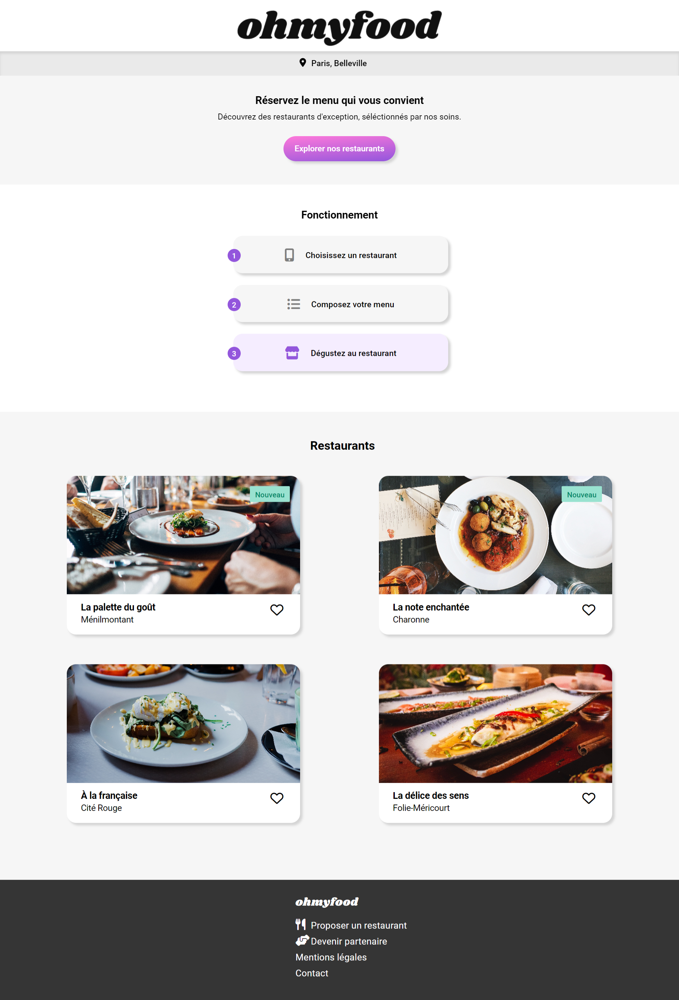
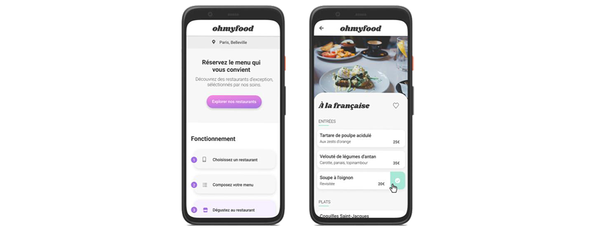

# 

### Visitez le projet réalisé <a href="https://greenbeetlestore.github.io/OhMyFood/">ici : https://greenbeetlestore.github.io/OhMyFood/</a>

# P3 Dynamisez une page web avec des animations CSS.

## Mission, Scénario

Vous venez d’être recruté chez Ohmyfood!, en tant que développeur junior. Félicitations !

Ohmyfood! est une jeune startup qui voudrait s'imposer sur le marché de la restauration. L'objectif est de développer un site 100% mobile qui répertorie les menus de restaurants gastronomiques. En plus des systèmes classiques de réservation, les clients pourront composer le menu de leur repas pour que les plats soient prêts à leur arrivée. Finis, les temps d'attente au restaurant !

Vous faites partie des 4 heureux élus qui ont la chance de travailler sur ce beau projet.

L’équipe se compose de :

· Paul, le CTO du futur site ;

· Fanny, l’UX designer recrutée pour mettre le site aux couleurs de Paris ;

· Anissa, commerciale chargée de démarcher les restaurants ;

· et vous, chargé du développement du site.

-----
        
- Anissa est en plein démarchage pour ce projet, auprès des restaurateurs. Elle vous interpelle à la machine à café :

Tu connais pas la nouvelle ? Tu te rappelles le responsable commercial de ton resto préféré ? J’ai réussi à le convaincre, avec 3 autres, de déposer leurs cartes en ligne ! Je t’envoie le dossier avec les 4 menus dans l’après-midi. À toi de jouer, maintenant !

Vous décidez alors, avec l’équipe, que le site contiendra 4 menus dans un premier temps. 

Voir plus ci-dessous le brief créatif que vous établissez avec le CTO, Paul.

De retour à votre bureau, vous trouvez un mail de Fanny qui vous envoie les maquettes du site.

Pour ce projet, vous versionnez tout votre code sur Github avec des commits réguliers pour suivre son avancement et publier le site en ligne plus facilement.

Vous avez désormais tous les éléments pour construire ce site mobile. 

Vous vous lancez dans cette nouvelle aventure !

=======================================================================

# Brief créatif

## Création du site Ohmyfood! Paris

## Sommaire

### Marque 

        · Identité
        
        · Proposition
        
        · Positionnement
        
        · Concurrence
        
        · Cible
        
        · Identité graphique
        
### Enjeux

        · Problématique
        
### Fonctionnement

        · Budget
        
        · Planning
        
        · Technologies
        
        · Compatibilité
        
### Livrables attendus

        · Contenu des pages
        
        · Effets graphiques et animations

## Marque

### Identité

Ohmyfood! est une entreprise de commande de repas en ligne. 

Notre concept permet aux utilisateurs de composer leur propre menu et réduire leur temps d’attente dans les restaurants car leur menu est préparé à l’avance. 

<b>Plus de perte de temps à consulter la carte!</b>

### Proposition

Nous souhaitons proposer à nos clients les menus de restaurants gastronomiques.

Développé à New-York dans un premier temps, nous souhaitons désormais élargir notre concept à la capitale de la gastronomie : Paris.

### Positionnement

Nous nous positionnons sur un marché de niche, avec les restaurants luxueux des villes dans lesquelles nous sommes établis.

Nous souhaitons être identifiés comme une entreprise proposant des services haut de gamme.

### Concurrence

· Nom de l'entreprise: <b>· Mylittlefoodie </b> 
        
        · Nombre de salariés: Environ 50 d’après leur site web.
        
        · Domaine d’activité: Réservation de tables dans les palaces parisiens.
        
        · Points positifs: Bonne implémentation en France. Tarifs préférentiels sur les menus. Site web très dynamique. Bon référencement.
        
        · Points négatifs: Pas de possibilité de voir les menus. Dates de réservation limitées à 2 jours par semaine.
        
· Nom de l'entreprise: <b>· LebonParis </b> 
        
        · Nombre de salariés: 15 salariés.
        
        · Domaine d’activité: Classement des restaurants en fonction de leurs menus.
        
        · Points positifs: Beaucoup de choix de restaurants. Menus très bien mis en avant sur la page d’accueil.
        
        · Points négatifs: Pas de possibilité de réservation. Pas de possibilité d’agrandir les menus.

### Cible

Classes moyennes et supérieures, connectées et souvent pressées, souhaitant déguster des produits de qualité.

### Identité graphique:

    <b>Polices</b>
    
        · Logo et titres: Shrikhand
        
        · Texte: Roboto
        
    <b>Couleurs</b>
    
        · Primaire: #9356DC
        
        · Secondaire: #FF79DA
        
        · Tertiaire: #99E2D0

## Enjeux

### Probématique
        
Nous souhaitons ouvrir nos services à la capitale française.

Objectifs:

    ● Phase 1 : Développer un site proposant le menu de 4 grands restaurants parisiens.

    ● Phase 2 : Permettre la réservation en ligne et la composition de menus.
    
## Fonctionnement
    
### Budget: 

20 000 €

### Planning:

    ● Date de livraison de la première version du site : sous 1 mois.
    
    ● Date de livraison de la deuxième version du site : sous 6 mois.
    
### Technologies:

    ● Le développement devra se faire en CSS, sans JavaScript.

    ● Aucun framework ne devra être utilisé, en revanche l’utilisation de SASS serait un plus.
    
    ● Aucun code CSS ne devra être appliqué via un attribut style dans une balise HTML.

    ● Tout le code doit être versionné sur GitHub et le site devra être accessible sur Github Pages une fois terminé.  

### Compatibilité:

La cible étant les personnes connectées et pressées, le site sera développé en utilisant l’approche mobile-first. 
Pour cette raison, seules des maquettes mobiles seront réalisées.

Sur tablette et desktop, le site devra s’adapter, mais ces supports n’étant pas prioritaires, leur mise en page est libre.

    ● L’ensemble du site devra être responsive sur mobile, tablette et desktop.

    ● Les pages devront passer la validation W3C en HTML et CSS sans erreur.
    
    ● Le site doit être parfaitement compatible avec les dernières versions desktop de Chrome et Firefox.
    
## Livrables attendus:

### 🟣 Contenu des pages

### Page d’accueil (x1)
    
    ● Affichage de la localisation des restaurants. À terme il sera possible de choisir sa localisation pour trouver des restaurants proches d’un certain lieu.
    
    ● Une courte présentation de l’entreprise.
        
    ● Une section contenant les 4 menus sous forme cartes. Au clic sur la carte, l’utilisateur est redirigé vers la page du menu.
    
### Pages de menu (x4)
    
    ● 4 pages contenant chacune le menu d’un restaurant.
        
### Footer
    
    ● Le footer est identique sur toutes les pages.

    ● Au clic sur “Contact”, un renvoi vers une adresse mail est effectué.
    
### Header
    
    ● Le header est présent sur toutes les pages.

    ● Sur la page d’accueil, il contient le logo du site.

    ● Sur les pages de menu, il contient en plus un bouton de retour vers la page d’accueil

### 🟣 Effets graphiques et animations

Les effets accessibles au clic ou au survol sont visibles sur la maquette. Ils devront utiliser les animations ou transitions CSS, pas de JavaScript ni de librairie.
    
### Boutons
    
    ● Au survol, la couleur de fond des boutons principaux devra légèrement s’éclaircir. L’ombre portée devra également être plus visible.

    ● À terme, les visiteurs pourront sauvegarder leurs menus préférés. Pour ça, un bouton "J’aime" en forme de cœur est présent sur la maquette. Au clic, il devra se remplir progressivement. Pour cette première version, l’effet peut être apparaître au survol sur desktop au lieu du clic.
    
### Page d’accueil
    
    ● Quand l’application aura plus de menus, un “loading spinner” sera nécessaire. Sur cette maquette, nous souhaitons en avoir un aperçu. Il devra apparaître pendant 1 à 3 secondes quand on arrive sur la page d'accueil, couvrir l'intégralité de l'écran, et utiliser les animations CSS (pas de librairie). Le design de ce loader n’est pas défini, toute proposition est donc la bienvenue tant qu’elle est cohérente avec la charte graphique du site.
            
### Pages de menu
    
    ● À l’arrivée sur la page, les plats devront apparaître progressivement avec un léger décalage dans le temps. Ils pourront soit apparaître un par un, soit par groupe “Entrée”, “Plat” et “Dessert”. Un exemple de l’effet attendu est fourni.

    ● Le visiteur peut ajouter les plats qu'il souhaite à sa commande en cliquant dessus. Cela fait apparaître une petite coche à droite du plat. Cette coche devra coulisser de la droite vers la gauche. Pour cette première version, l’effet peut apparaître au survol sur desktop au lieu du clic. Si l’intitulé du plat est trop long, il devra être rogné avec des points de suspension. Un exemple de l’effet attendu est fourni.
            
## Organisation interne du projet
    
· Chef de projet : Paul
· UX Designer : Fanny
· Commerciale : Anissa
· Développeur : Xavier Torta, Green Beetle.
        
Circuit de validation : toutes les étapes du projet seront validées par Paul.

## Compétences évaluées

        · Utiliser un système de gestion de versions pour le suivi du projet et son hébergement
        
        · Mettre en place son environnement Front-End
        
        · Assurer la cohérence graphique d'un site web
        
        · Mettre en place une structure de navigation pour un site web
        
        · Mettre en œuvre des effets CSS graphiques avancés
